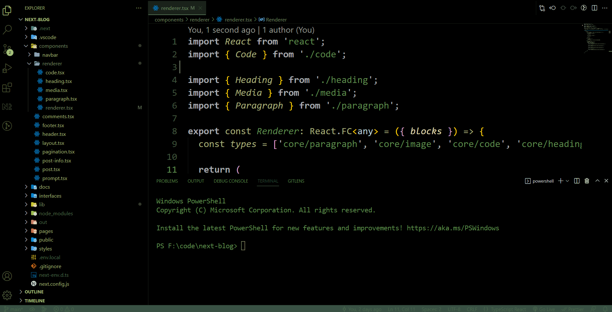

# 💾 Matrix Reloded

> A **_Matrix_** styled theme for Visual Studio Code

## Preview:

## Installation

1. Launch Visual Studio Code
2. Open the extensions option from sidebar (or Ctrl+Shift+X)
3. Search for matrix-reloaded
4. Click Install
5. Manage > Color Theme > Matrix

## Feedback

If you have suggestions, feel free to open an issue or a pull request.

## Author

Authored By [Harshal S. Limaye](https://www.linkedin.com/in/harshal-limaye/)
